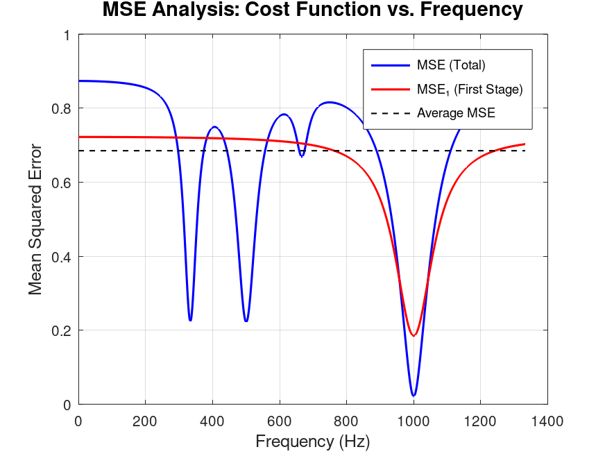
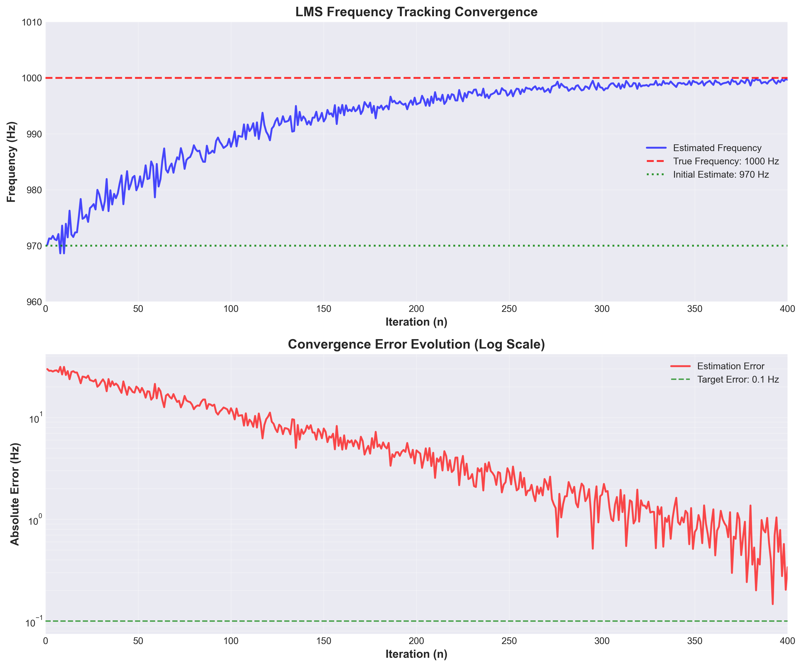
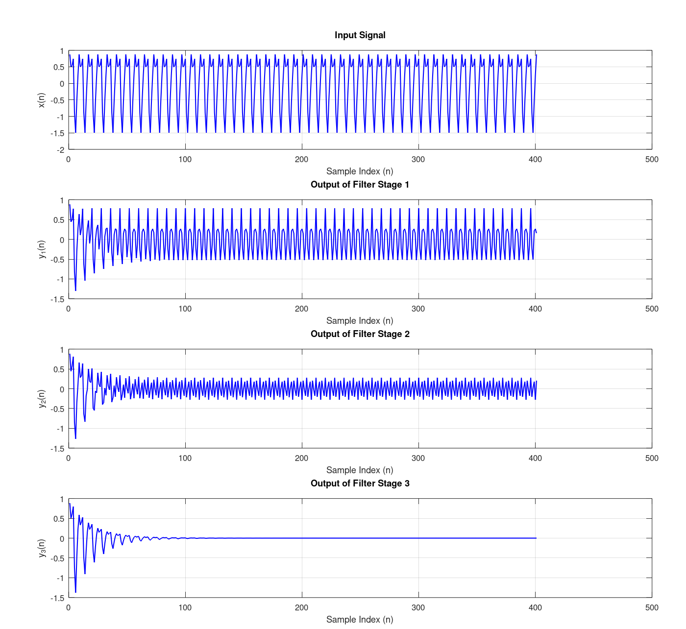
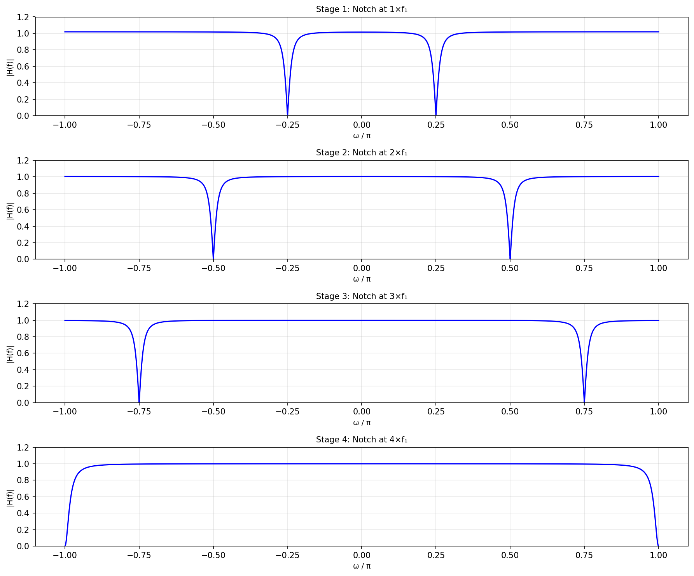
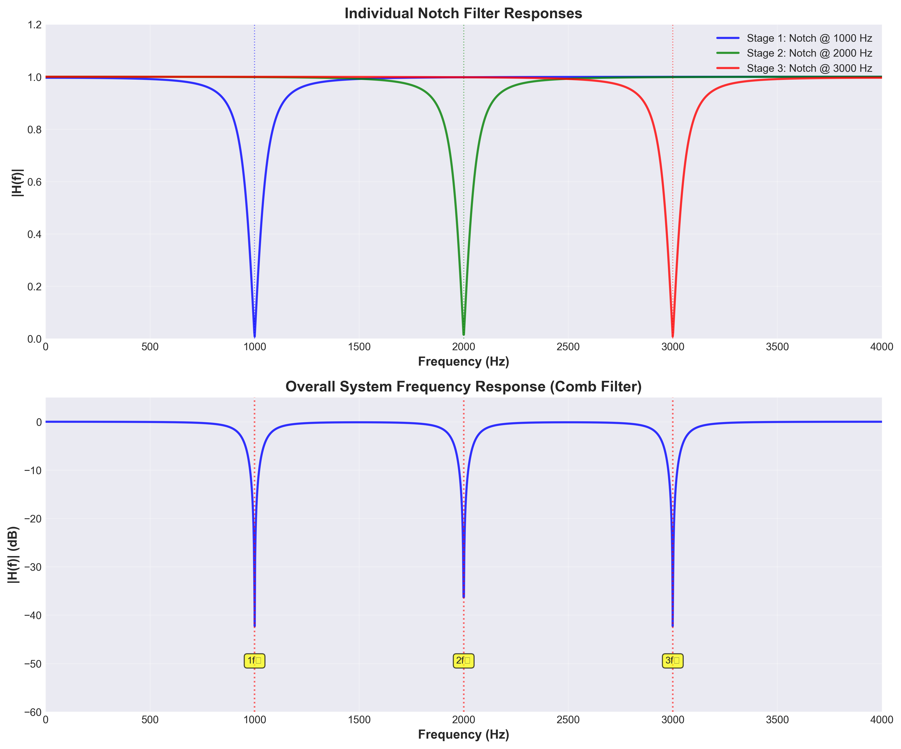

# Adaptive Frequency Estimation using LMS Algorithm

A MATLAB/Octave implementation of an adaptive IIR filter for frequency estimation and tracking.

## Overview

This project implements the algorithm from the paper **"Novel Adaptive IIR Filter for Frequency Estimation and Tracking"** by Li Tan and Jean Jiang. The algorithm estimates and tracks the fundamental frequency of a harmonic signal using a cascaded notch filter bank and adaptive LMS (Least Mean Squares) optimization.

### Key Features

- **Adaptive Frequency Tracking**: Automatically estimates and tracks fundamental frequency
- **Harmonic Rejection**: Cascaded notch filters remove harmonic components
- **LMS Optimization**: Gradient-based adaptive algorithm for convergence

## Algorithm Description

The algorithm operates in four main phases:

### Phase 1: Initial Frequency Estimation
- Searches the frequency range θ ∈ [0, π/M] to find an initial estimate
- Computes MSE (Mean Squared Error) for each candidate frequency
- Identifies the capture range where both MSE and MSE₁ are below average
- Selects initial estimate within the capture range



*Figure 1: MSE cost function analysis showing MSE(θ) and MSE₁(θ) curves used for initial frequency estimation*

### Phase 2: LMS Frequency Tracking
- Applies LMS algorithm to refine the frequency estimate
- Update rule: **θ(n+1) = θ(n) - 2μ·y_M(n)·β_M(n)**
- Iteratively minimizes the MSE cost function
- Converges to the true fundamental frequency



*Figure 2: LMS convergence showing frequency tracking (top) and error evolution (bottom)*

### Phase 3: Filter Output Analysis
- Computes final filter bank output with converged frequency
- Visualizes signal progression through each filter stage
- Shows how harmonics are progressively removed



*Figure 3: Signal progression through cascaded filter bank showing harmonic removal*

### Phase 4: Frequency Response Analysis
- Computes and visualizes frequency response of the filter bank
- Shows individual notch filter responses
- Displays overall system response (comb filter)



*Figure 4: Individual notch filter stage responses showing notch locations at harmonics*



*Figure 5: Frequency response showing individual notch filters (top) and overall comb filter response (bottom) with harmonic markers*


### Setup

1. Clone the repository:
```bash
git clone git@github.com:hadimp/FrequencyEstimation.git
cd frequency-estimation
```

2. Start MATLAB/Octave and run the startup script:
```matlab
cd src
startup
```

The `startup` script will:
- Add all required paths to MATLAB/Octave
- Create the output directory
- Display available commands

## Quick Start

```matlab
% Run with default configuration
startup
results = run_frequency_estimation();
```

This will:
1. Generate a test signal with harmonics
2. Estimate the fundamental frequency
3. Track the frequency using LMS algorithm
4. Generate visualizations
5. Save results to files

## Configuration

All parameters are configured through the `config()` function. Default values:

### Signal Parameters
```matlab
cfg.signal.fundamental_freq = 1000;     % Fundamental frequency f₁ (Hz)
cfg.signal.sampling_freq = 8000;        % Sampling frequency fs (Hz)
cfg.signal.num_samples = 400;           % Number of samples N
cfg.signal.add_noise = false;          % Add Gaussian noise flag
cfg.signal.snr_db = 18;                % SNR in dB (if noise enabled)
```

### Filter Parameters
```matlab
cfg.filter.num_subfilters = 3;          % Number of harmonic subfilters M
cfg.filter.pole_radius = 0.95;         % Pole radius r (0 < r < 1)
```

### LMS Algorithm Parameters
```matlab
cfg.lms.step_size = 0.0001;            % Step size μ
cfg.lms.num_theta_points = 1400;       % Resolution for theta search
```

### Output Parameters
```matlab
cfg.output.directory = 'output/';       % Output directory
cfg.output.save_figures = true;        % Save figures to disk
cfg.output.save_results = true;        % Save results to file
cfg.output.figure_format = 'png';      % Figure format: 'png', 'eps', 'pdf'
```

## Output Files

The algorithm generates several output files:

### Figures (saved to `output/` directory)

1. **`mse_analysis.png`**: MSE cost function landscape
2. **`frequency_tracking.png`**: LMS convergence plot
3. **`filter_signals.png`**: Filter bank signal progression
4. **`stage_responses.png`**: Individual filter stage responses
5. **`overall_response.png`**: Overall system response (linear scale)
6. **`overall_response_db.png`**: Overall system response (dB scale)

### Data Files

1. **`frequency_estimation_YYYYMMDD_HHMMSS.mat`**: Complete results structure
2. **`frequency_estimation_YYYYMMDD_HHMMSS_summary.txt`**: Human-readable summary

## Project Structure

```
frequency-estimation/
├── src/
│   ├── config/          # Configuration management
│   ├── core/             # Core algorithm functions
│   ├── utils/            # Utility functions
│   ├── visualization/    # Plotting functions
│   ├── run_frequency_estimation.m
│   └── startup.m
├── output/               # Generated outputs
├── scripts/              # Python visualization script
└── README.md
```

## References

**Primary Reference:**
- L. Tan and J. Jiang, "Novel adaptive IIR filter for frequency estimation and tracking [DSP Tips&Tricks]," in *IEEE Signal Processing Magazine*, vol. 26, no. 6, pp. 186-189, November 2009. [DOI: 10.1109/MSP.2009.934189](https://doi.org/10.1109/MSP.2009.934189)

---
