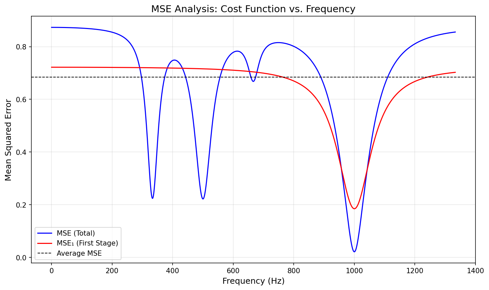
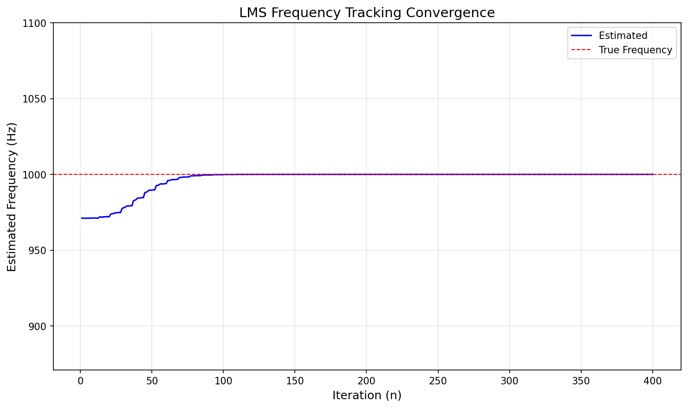
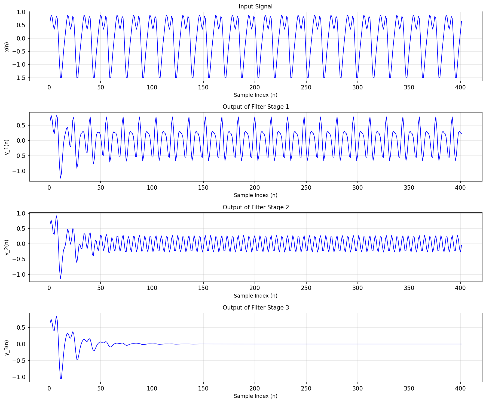
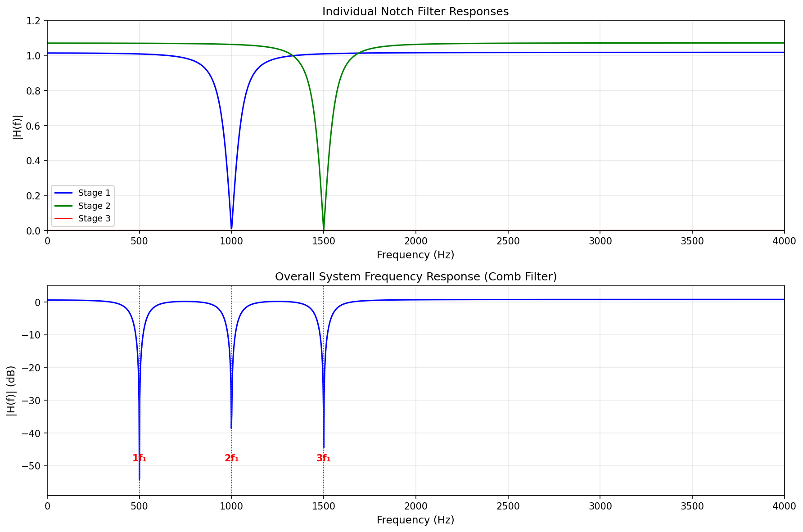

# Adaptive Frequency Estimation using LMS Algorithm

A dual-language implementation (MATLAB/Octave and Python) of an adaptive IIR filter for frequency estimation and tracking.

## Overview

This project implements the algorithm from the paper **"Novel Adaptive IIR Filter for Frequency Estimation and Tracking"** by Li Tan and Jean Jiang (IEEE Signal Processing Magazine, 2009). The algorithm estimates and tracks the fundamental frequency of a harmonic signal using a cascaded notch filter bank and adaptive LMS (Least Mean Squares) optimization.



### Key Features

- **Dual Implementation**: Both MATLAB/Octave and Python versions
- **Adaptive Frequency Tracking**: Automatically estimates and tracks fundamental frequency
- **Harmonic Rejection**: Cascaded notch filters remove harmonic components
- **LMS Optimization**: Gradient-based adaptive algorithm for convergence
- **Comprehensive Visualization**: MSE analysis, convergence plots, frequency response

## Project Structure

```
frequency-estimation/
├── matlab/                      # MATLAB/Octave implementation
│   ├── src/
│   │   ├── config/              # Configuration management
│   │   ├── core/                # Core algorithm functions
│   │   ├── utils/               # Utility functions
│   │   ├── visualization/       # Plotting functions
│   │   ├── run_frequency_estimation.m
│   │   └── startup.m
│   └── README.md
├── python/                      # Python implementation
│   ├── src/
│   │   └── frequency_estimation/
│   │       ├── config.py        # Configuration management
│   │       ├── core/            # Core algorithm modules
│   │       ├── utils/           # Utility functions
│   │       ├── visualization/   # Plotting functions
│   │       └── run.py           # Main entry point
│   ├── pyproject.toml           # Package configuration
│   ├── requirements.txt
│   └── README.md
├── output/                      # Generated outputs (shared)
└── README.md                    # This file
```

## Algorithm Description

The algorithm operates in four main phases:

### Phase 1: Initial Frequency Estimation
- Searches the frequency range θ ∈ [0, π/M] to find an initial estimate
- Computes MSE (Mean Squared Error) for each candidate frequency
- Identifies the capture range where both MSE and MSE₁ are below average
- Selects initial estimate within the capture range

### Phase 2: LMS Frequency Tracking
- Applies LMS algorithm to refine the frequency estimate
- Update rule: **θ(n+1) = θ(n) - 2μ·y_M(n)·β_M(n)**
- Iteratively minimizes the MSE cost function
- Converges to the true fundamental frequency



### Phase 3: Filter Output Analysis
- Computes final filter bank output with converged frequency
- Visualizes signal progression through each filter stage
- Shows how harmonics are progressively removed



### Phase 4: Frequency Response Analysis
- Computes and visualizes frequency response of the filter bank
- Shows individual notch filter responses
- Displays overall system response (comb filter)



## Quick Start

### MATLAB/Octave

```matlab
% Navigate to MATLAB source directory
cd matlab/src

% Run startup to set up paths
startup

% Run with default configuration
results = run_frequency_estimation();

% Or with custom configuration
cfg = config();
cfg.signal.fundamental_freq = 500;
results = run_frequency_estimation(cfg);
```

### Python

```bash
# Install dependencies
cd python
pip install -e .

# Run from command line
frequency-estimation

# Or run with custom frequency
frequency-estimation --freq 500
```

```python
# Or use as a library
from frequency_estimation import run_frequency_estimation, Config

# Run with defaults
results = run_frequency_estimation()

# Run with custom configuration
cfg = Config()
cfg.signal.fundamental_freq = 500
cfg.signal.add_noise = True
cfg.signal.snr_db = 20
results = run_frequency_estimation(cfg)
```

## Configuration

Both implementations share the same parameter structure:

### Signal Parameters
| Parameter | Default | Description |
|-----------|---------|-------------|
| `fundamental_freq` | 1000 | Fundamental frequency f₁ (Hz) |
| `sampling_freq` | 8000 | Sampling frequency fs (Hz) |
| `num_samples` | 400 | Number of samples N |
| `add_noise` | false | Add Gaussian noise flag |
| `snr_db` | 18 | SNR in dB (if noise enabled) |

### Filter Parameters
| Parameter | Default | Description |
|-----------|---------|-------------|
| `num_subfilters` | 3 | Number of harmonic subfilters M |
| `pole_radius` | 0.95 | Pole radius r (0 < r < 1) |

### LMS Parameters
| Parameter | Default | Description |
|-----------|---------|-------------|
| `step_size` | 0.0001 | Step size μ |
| `num_theta_points` | 1400 | Resolution for theta search |

## Output Files

The algorithm generates several output files in the `output/` directory:

### Figures
- `mse_analysis.png`: MSE cost function landscape
- `frequency_tracking.png`: LMS convergence plot
- `filter_signals.png`: Filter bank signal progression
- `stage_responses.png`: Individual filter stage responses
- `overall_response.png`: Overall system response (linear scale)
- `overall_response_db.png`: Overall system response (dB scale)
- `frequency_response_plot.png`: Combined frequency response plot

### Data Files
- MATLAB: `frequency_estimation_YYYYMMDD_HHMMSS.mat`
- Python: `frequency_estimation_YYYYMMDD_HHMMSS.npz`
- Summary: `frequency_estimation_YYYYMMDD_HHMMSS_summary.txt`


### Python
- Python 3.10+
- NumPy >= 1.20.0
- SciPy >= 1.7.0
- Matplotlib >= 3.5.0

## References

**Primary Reference:**
- L. Tan and J. Jiang, "Novel adaptive IIR filter for frequency estimation and tracking [DSP Tips&Tricks]," in *IEEE Signal Processing Magazine*, vol. 26, no. 6, pp. 186-189, November 2009. [DOI: 10.1109/MSP.2009.934189](https://doi.org/10.1109/MSP.2009.934189)

