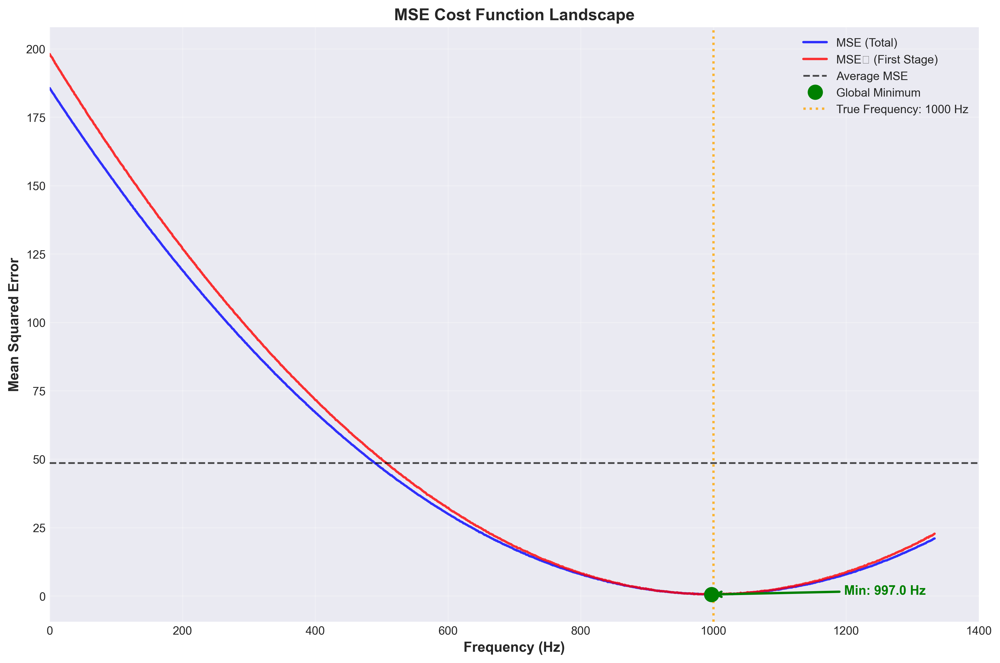

# Adaptive Frequency Estimation using LMS Algorithm

A MATLAB/Octave implementation of an adaptive IIR filter for frequency estimation and tracking using cascaded notch filters and the Least Mean Squares (LMS) algorithm.

## Table of Contents

- [Overview](#overview)
- [Algorithm Description](#algorithm-description)
- [Mathematical Background](#mathematical-background)
- [Installation](#installation)
- [Quick Start](#quick-start)
- [Usage](#usage)
- [Configuration](#configuration)
- [Output Files](#output-files)
- [Project Structure](#project-structure)
- [Examples](#examples)
- [References](#references)

## Overview

This project implements the algorithm from the paper **"Novel Adaptive IIR Filter for Frequency Estimation and Tracking"** by Li Tan and Jean Jiang. The algorithm estimates and tracks the fundamental frequency of a harmonic signal using a cascaded notch filter bank and adaptive LMS (Least Mean Squares) optimization.

### Key Features

- **Adaptive Frequency Tracking**: Automatically estimates and tracks fundamental frequency
- **Harmonic Rejection**: Cascaded notch filters remove harmonic components
- **LMS Optimization**: Gradient-based adaptive algorithm for convergence
- **Comprehensive Visualization**: Multiple plots showing algorithm performance
- **Modular Architecture**: Clean, well-documented, maintainable code
- **MATLAB/Octave Compatible**: Works with both MATLAB and Octave
- **Configurable**: Easy-to-use configuration system

## Algorithm Description

The algorithm operates in four main phases:

### Phase 1: Initial Frequency Estimation
- Searches the frequency range θ ∈ [0, π/M] to find an initial estimate
- Computes MSE (Mean Squared Error) for each candidate frequency
- Identifies the capture range where both MSE and MSE₁ are below average
- Selects initial estimate within the capture range


*Figure 1: MSE cost function analysis showing MSE(θ) and MSE₁(θ) curves used for initial frequency estimation*

### Phase 2: LMS Frequency Tracking
- Applies LMS algorithm to refine the frequency estimate
- Update rule: **θ(n+1) = θ(n) - 2μ·y_M(n)·β_M(n)**
- Iteratively minimizes the MSE cost function
- Converges to the true fundamental frequency


*Figure 2: LMS convergence showing frequency tracking (top) and error evolution (bottom)*

### Phase 3: Filter Output Analysis
- Computes final filter bank output with converged frequency
- Visualizes signal progression through each filter stage
- Shows how harmonics are progressively removed


*Figure 3: Signal progression through cascaded filter bank showing harmonic removal*

### Phase 4: Frequency Response Analysis
- Computes and visualizes frequency response of the filter bank
- Shows individual notch filter responses
- Displays overall system response (comb filter)


*Figure 4: Individual notch filter stage responses showing notch locations at harmonics*

## Mathematical Background

### Filter Bank Structure

The algorithm uses a cascade of M second-order IIR notch filters. Each filter has the transfer function:

```
H_m(z) = (1 - 2cos(mθ)z⁻¹ + z⁻²) / (1 - 2r·cos(mθ)z⁻¹ + r²z⁻²)
```

where:
- **θ = 2πf₁/fs** is the normalized fundamental frequency
- **m** is the harmonic index (1, 2, ..., M)
- **r** is the pole radius (0 < r < 1), controlling notch bandwidth

The numerator places zeros on the unit circle at ±mθ (perfect nulls), while the denominator places poles at radius r, controlling the sharpness of the notch.

### LMS Update Rule

The LMS algorithm minimizes the MSE cost function:

```
J(θ) = E[y_M²(n)]
```

The gradient-based update rule is:

```
θ(n+1) = θ(n) - 2μ·y_M(n)·β_M(n)
```

where:
- **μ** is the step size (controls convergence speed vs. stability)
- **y_M(n)** is the output of the final filter stage
- **β_M(n) = ∂y_M(n)/∂θ** is the gradient of the filter output

The gradient β_M(n) is computed recursively through the filter stages using the chain rule.


*Figure 5: Frequency response of individual notch filters (top) and overall system comb filter (bottom)*

### MSE Cost Function



*Figure 6: MSE cost function landscape showing the search space and global minimum*

The Mean Squared Error is defined as:

```
MSE = (1/N) Σ y_M(n)²
```

When θ matches the true fundamental frequency:
- The notch filters align with signal harmonics
- Signal components are nulled out
- MSE approaches zero (or noise floor if noise is present)

When θ is incorrect:
- Signal energy passes through the filters
- MSE is large

## Installation

### Prerequisites

- **MATLAB** (R2016b or later) or **GNU Octave** (5.0 or later)
- Signal Processing Toolbox (optional, for `mag2db` function)
- Communications Toolbox (optional, for `awgn` function)

### Setup

1. Clone the repository:
```bash
git clone git@github.com:hadimp/FrequencyEstimation.git
cd frequency-estimation
```

2. Start MATLAB/Octave and run the startup script:
```matlab
cd src
startup
```

The `startup` script will:
- Add all required paths to MATLAB/Octave
- Create the output directory
- Display available commands

## Quick Start

```matlab
% Run with default configuration
startup
results = run_frequency_estimation();
```

This will:
1. Generate a test signal with harmonics
2. Estimate the fundamental frequency
3. Track the frequency using LMS algorithm
4. Generate visualizations
5. Save results to files

## Usage

### Basic Usage

```matlab
% Use default configuration
results = run_frequency_estimation();

% Use custom configuration
cfg = config();
cfg.signal.fundamental_freq = 500;  % Change fundamental frequency
cfg.signal.add_noise = true;        % Enable noise
cfg.signal.snr_db = 20;             % Set SNR to 20 dB
results = run_frequency_estimation(cfg);
```

### Loading Configuration from File

```matlab
% Save a custom configuration
cfg = config();
cfg.signal.fundamental_freq = 750;
save_config(cfg, 'my_config.mat');

% Load and use it
results = run_frequency_estimation('my_config.mat');
```

### Accessing Results

The `results` structure contains:

```matlab
results.config              % Configuration used
results.initial_theta       % Initial frequency estimate (radians)
results.initial_freq        % Initial frequency estimate (Hz)
results.final_theta         % Final converged estimate (radians)
results.final_freq          % Final converged estimate (Hz)
results.theta_history       % History of θ estimates (N x 1)
results.mse_values          % MSE values over theta range
results.mse_first_values    % First-stage MSE values
results.theta_range         % Theta values searched
results.filter_output       % Final filter bank output (M+1 x N+1)
results.error_hz            % Estimation error in Hz
results.error_percent       % Estimation error percentage
```

## Configuration

All parameters are configured through the `config()` function. Default values:

### Signal Parameters
```matlab
cfg.signal.fundamental_freq = 1000;     % Fundamental frequency f₁ (Hz)
cfg.signal.sampling_freq = 8000;        % Sampling frequency fs (Hz)
cfg.signal.num_samples = 400;           % Number of samples N
cfg.signal.add_noise = false;          % Add Gaussian noise flag
cfg.signal.snr_db = 18;                % SNR in dB (if noise enabled)
```

### Filter Parameters
```matlab
cfg.filter.num_subfilters = 3;          % Number of harmonic subfilters M
cfg.filter.pole_radius = 0.95;         % Pole radius r (0 < r < 1)
```

### LMS Algorithm Parameters
```matlab
cfg.lms.step_size = 0.0001;            % Step size μ
cfg.lms.num_theta_points = 1400;       % Resolution for theta search
```

### Output Parameters
```matlab
cfg.output.directory = 'output/';       % Output directory
cfg.output.save_figures = true;        % Save figures to disk
cfg.output.save_results = true;        % Save results to file
cfg.output.figure_format = 'png';      % Figure format: 'png', 'eps', 'pdf'
```

## Output Files

The algorithm generates several output files:

### Figures (saved to `output/` directory)

1. **`mse_analysis.png`**: MSE cost function landscape
2. **`frequency_tracking.png`**: LMS convergence plot
3. **`filter_signals.png`**: Filter bank signal progression
4. **`stage_responses.png`**: Individual filter stage responses
5. **`overall_response.png`**: Overall system response (linear scale)
6. **`overall_response_db.png`**: Overall system response (dB scale)

### Data Files

1. **`frequency_estimation_YYYYMMDD_HHMMSS.mat`**: Complete results structure
2. **`frequency_estimation_YYYYMMDD_HHMMSS_summary.txt`**: Human-readable summary

## Project Structure

```
frequency-estimation/
├── src/
│   ├── config/          # Configuration management
│   ├── core/             # Core algorithm functions
│   ├── utils/            # Utility functions
│   ├── visualization/    # Plotting functions
│   ├── run_frequency_estimation.m
│   └── startup.m
├── output/               # Generated outputs
├── scripts/              # Python visualization script
└── README.md
```

## Examples

### Example 1: Basic Frequency Estimation

```matlab
startup
results = run_frequency_estimation();
fprintf('Estimated frequency: %.2f Hz\n', results.final_freq);
```

### Example 2: Noisy Signal

```matlab
cfg = config();
cfg.signal.add_noise = true;
cfg.signal.snr_db = 15;
results = run_frequency_estimation(cfg);
```

## Python Visualizations

For additional publication-quality visualizations:

```bash
pip install -r requirements.txt
python scripts/create_visualizations.py
```

## References

**Primary Reference:**
- L. Tan and J. Jiang, "Novel adaptive IIR filter for frequency estimation and tracking [DSP Tips&Tricks]," in *IEEE Signal Processing Magazine*, vol. 26, no. 6, pp. 186-189, November 2009. [DOI: 10.1109/MSP.2009.934189](https://doi.org/10.1109/MSP.2009.934189)

**Original Implementation:**
- Author: Hadi Mohammadpour
- Course: ENGI 9821 - Digital Signal Processing
- Institution: Memorial University of Newfoundland
- Year: Winter 2021

---

**Note**: The original monolithic script (`Main.m`) and functions are preserved for reference. The refactored modular code is in the `src/` directory.
